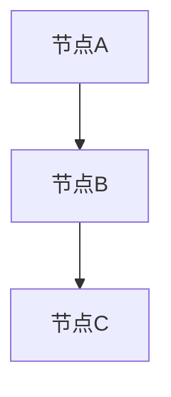
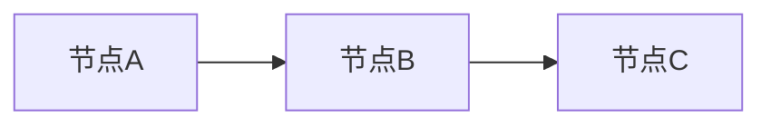
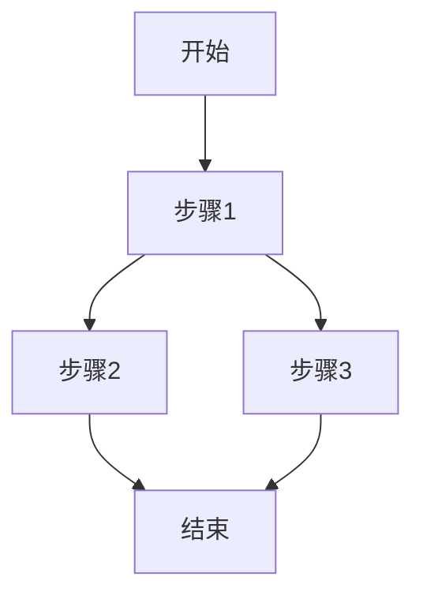
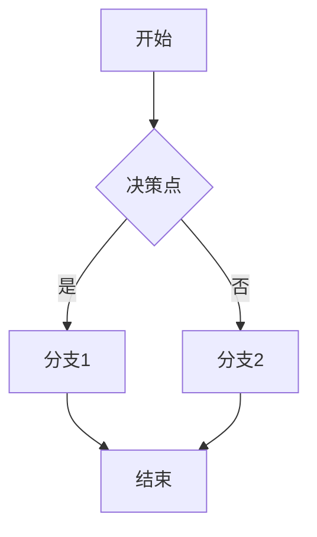
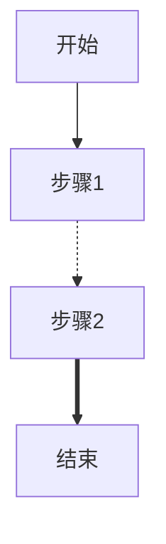
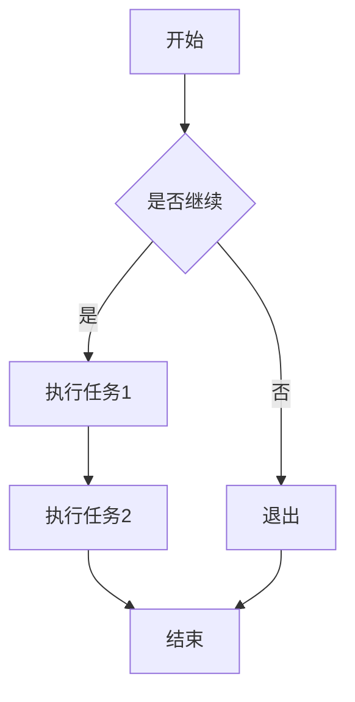

- `graph TD` 表示绘制从上到下的流程图。TD 代表 "Top to Down"。
- `A --> B` 表示从节点A指向节点B。
- 节点的内容用方括号 `[]` 表示，形状可以是圆角矩形 `[节点]` 或者圆形 `(节点)`。

### 2. 图的方向

可以使用不同的方向控制流程图的布局方式：
- `TD`：从上到下 (Top to Down)
- `LR`：从左到右 (Left to Right)
- `BT`：从下到上 (Bottom to Top)
- `RL`：从右到左 (Right to Left)

例如：

### 3. 多分支流程

一个节点可以指向多个节点，表示流程的不同分支。示例如下：
 

 
这将绘制一个从 `步骤1` 分支到 `步骤2` 和 `步骤3` 的流程。

 
### 4. 使用不同的节点形状
 
Mermaid 支持多种节点形状：
- 圆角矩形：`A[内容]`
- 圆形：`A((内容))`
- 菱形：`A{内容}`
 
例如：
 

### 5. 添加样式
 
可以为节点和边线添加不同的样式：
 

 
- `-.->` 表示虚线箭头。
- `==>` 表示加粗箭头。

 
### 6. 示例
 
这是一个完整的例子，包含了各种流程图元素：
 

 
### 小结
 
- 使用 `mermaid` 标签来创建流程图。
- 使用 `-->` 来连接节点，指定流程走向。
- 可以通过不同的方向、分支、形状和样式来丰富流程图的表达。